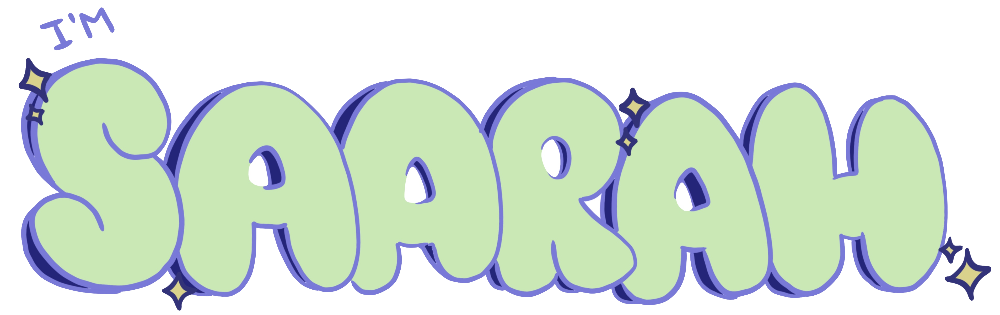
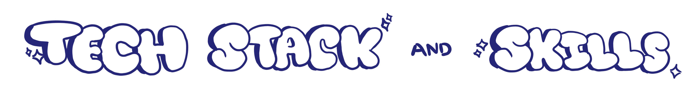
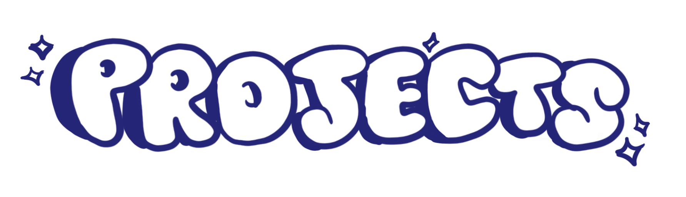
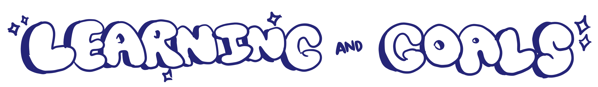
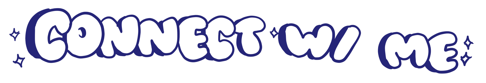

### Hi there! 👋 Welcome to my GitHub profile!

I'm a junior developer passionate about building web applications and learning new technologies.  
Currently exploring React, Python, and full-stack development to improve my skills.

I recently graduated from Loyola Marymount University with a major in Computer Science and a minor in Statistics and Data Science in May 2024. I'm currently looking for work as a Software Engineer, Data Scientist, UI/UX Designer, Front End Developer or Backend Developer. During my time at LMU, my favorite subjects included Database Systems, Web App Development, Linear Algebra, and Human Computer Interaction. Some non-technical courses I liked were Art History and Printmaking!

I hope I can use my Github profile to showcase more projects that I will (hopefully) be programming in my free time. Thanks for stopping by, and feel free to look at any of the repos  I already have on my profile to gain insights into some of my favorite Front End Development/UI Design related projects such as "The Book Nook" or the compound interest calculator. You can see these projects under the Projects heading below!

Add some info about tech stack and skills.

Add some info about projects here.

Add some info about what you are learning currently.

You can find me at the following links:

[Personal Website](https://speer987.github.io/personal-website/)
[LinkedIn](https://www.linkedin.com/in/saarah-peer/)

### Some fun facts about me...
- I like to explore new hobbies. Lately, I've been crocheting a lot and also painting, which are two of my old hobbies. I'm interested in the fiber arts and want to learn more about punch needling and knitting! I think my passion for crochet is what drew me towards programming because I had to learn how to read patterns, which is similar to the syntax used when coding.
- I doodled all of the headings on this readme file!

